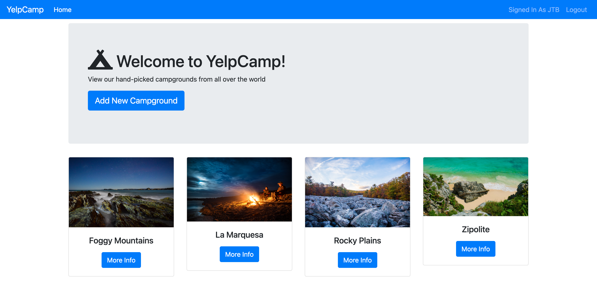

# YelpCamp

This app lets the user see different camping sites added by her or other users, includes the locations using the google mas API, the user can rate them, comment on them, and delete their own, it also lets the user create a profile in wich is displayed the camps that the user added, add a profile picture, and write a profile description. It has a sign in and a sign up feautre with the capability of recovering the password.

## Screenshot

## Live Demo

https://stormy-plains-21878.herokuapp.com/

## Built With 🛠

- Mongo
- Express
- Node
- VSCode

## Author

### 👨‍💻 Jorge Torres

- Github: [Jorge Torres](https://github.com/Yors-git)
- Linkedin: [Jorge Torres](https://www.linkedin.com/in/jtbribiesca/)
- Twitter: [@Yors_82](https://twitter.com/Yors_82)

### 🤝 Contributing

Contributions, issues and feature requests are welcome!

### Show your support

Give a ⭐️ if you like this project!

### License

This project belongs to Jorge Torres, all rights reserved.